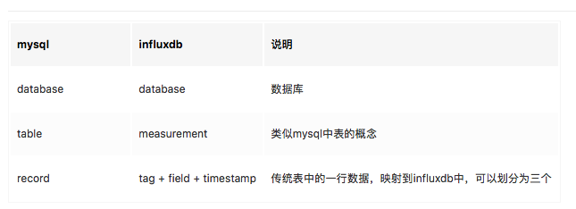
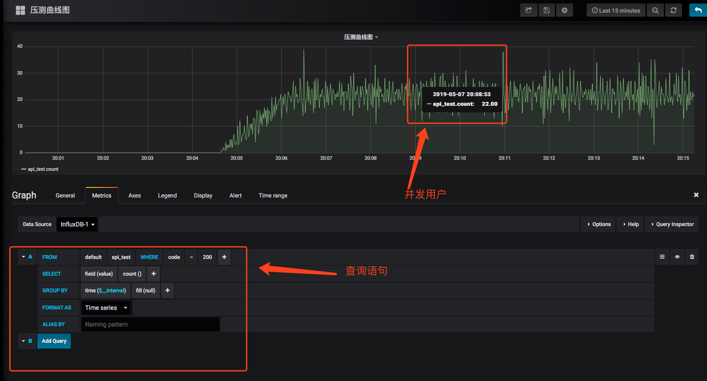

# 简介


# InfluxDB基本概念
InfluxDB作为时序数据库,支持海量数据存储,读写速度和占用磁盘空间优于mysql.

## 参数介绍




## 非docker安装
```
brew update
brew install influxdb
ln -sfv /usr/local/opt/influxdb/*.plist ~/Library/LaunchAgents

# 配置文件在/etc/influxdb/influxdb.conf ，如果没有就将/usr/local/etc/influxdb.conf 拷一个过去
配置缓存：cache-max-memory-size

#启动服务
launchctl load ~/Library/LaunchAgents/homebrew.mxcl.influxdb.plist

#停止服务
launchctl unload ~/Library/LaunchAgents/homebrew.mxcl.influxdb.plist

#前台启动
influxd -config /usr/local/etc/influxdb.conf

查看influxdb运行配置
influxd config
```

# 启动客户端
```angularjs
influx -precision rfc3339
```

# 数据库操作
```angularjs
CREATE DATABASE mydb

drop database mydb

use mydb
```

# docker安装
```
docker run -d -p 8083:8083 -p 8086:8086  -v $PWD:/var/lib/influxdb -v $PWD/influxdb.conf:/etc/influxdb/influxdb.conf influxdb
```

# influxdb-python

使用pyton代码操作influxdb
```
https://pypi.org/project/influxdb/

pip install influxdb
```

# grafana

docker环境搭建
```
docker run -d --name=grafana1 -p 9100:3000 grafana/grafana
```
浏览器访问:127.0.0.1:3000

账号:admin 密码:123321


# docker-compose搭建(推荐)

```angularjs
docker-compose -f docker-compose.yml up -d
```


# locust

运行命令
```angularjs
locust -f locustfile.py --host=http://www.126.com （web模式）

locust -f locustfile.py --host=http://www.126.com --no-web  -c 1000 -t 300s (命令行模式）
```


# 压测曲线图




# 参考

locust介绍<br>
https://locust.io

locust介绍教程<br>
https://docs.locust.io/en/latest/writing-a-locustfile.html

Locust压力测试使用总结<br>
https://blog.csdn.net/JOJOY_tester/article/details/77926470

InfluxDB基本概念小结<br>
https://juejin.im/post/5b59b9b9f265da0f87593981
